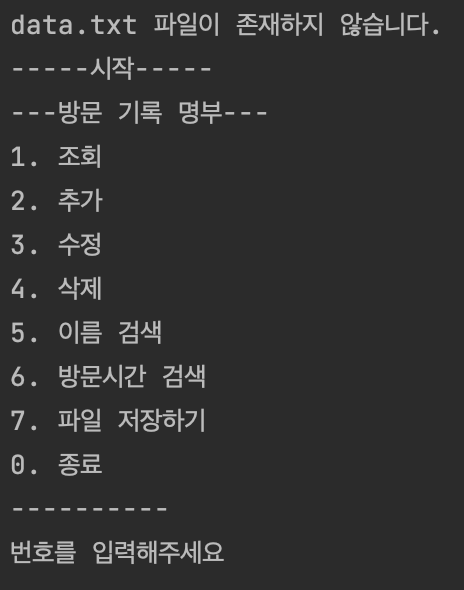
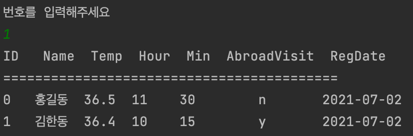
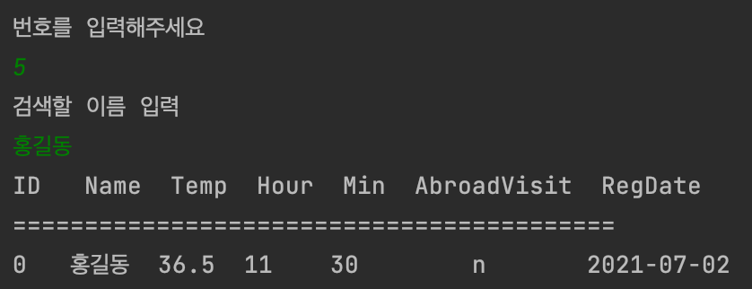
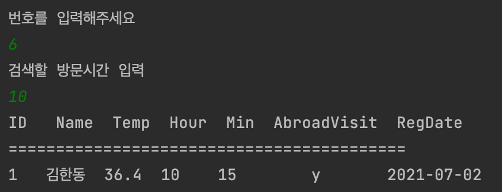
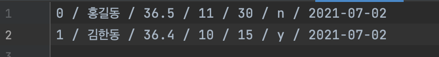

# PassList
이전 https://github.com/ggpark1218/HelloWorld.git 프로젝트와 동일하지만 파일 불러오기 기능 추가하였다.

### 1. 메뉴 수정

### 2. 검색 기능 추가
    
* 데이터를 미리 추가 하고 조회한 화면
  
    

* 이름 검색
  
  
  
* 방문시간 검색

  

### 3. 파일 저장, 불러오기 추가

* 파일 저장하기
  
  
  
* 저장한 data.txt 파일
  
  

